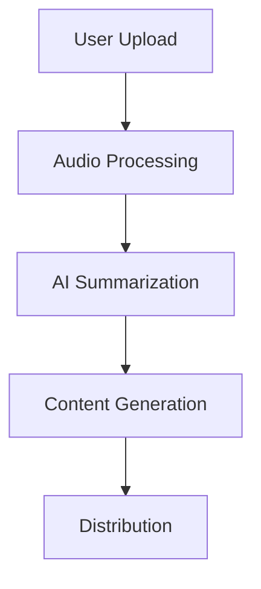
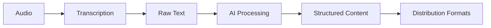

# Podcast Summarizer Project Flow

## Architecture Overview

## Core Flow

1. **Content Ingestion**
   - RSS feed parsing
   - Direct audio upload
   - URL processing

2. **Processing Pipeline**
   - Audio transcription
   - Noise reduction
   - Speaker diarization

3. **AI Analysis**
   - Key points extraction
   - Topic identification
   - Sentiment analysis
   - Timestamp mapping

4. **Content Generation**
   - Summary creation
   - Key takeaways
   - Timeline generation
   - Engagement metrics

5. **Distribution**
   - Newsletter formatting
   - Social media snippets
   - Embed code generation
   - API access

## Data Flow

## Tech Stack

- **Frontend**: Next.js 14, React, Tailwind, Shadcn
- **Backend**: Node.js, TypeScript
- **AI**: OpenAI API
- **Database**: Supabase
- **Audio**: Whisper API
- **Storage**: Supabase Storage

## User Journey

1. **Authentication**
   - Sign up/Login
   - Account setup
   - Subscription management

2. **Content Upload**
   - File upload interface
   - RSS feed connection
   - URL submission

3. **Processing**
   - Progress tracking
   - Error handling
   - Status notifications

4. **Results**
   - Summary view
   - Export options
   - Sharing capabilities

5. **Management**
   - Content library
   - Analytics dashboard
   - Settings configuration 